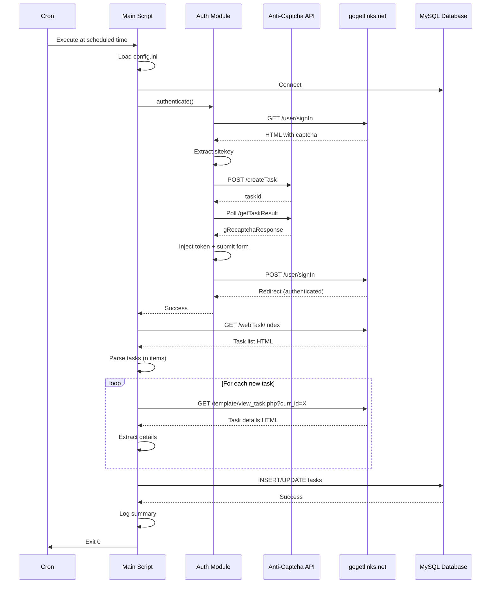
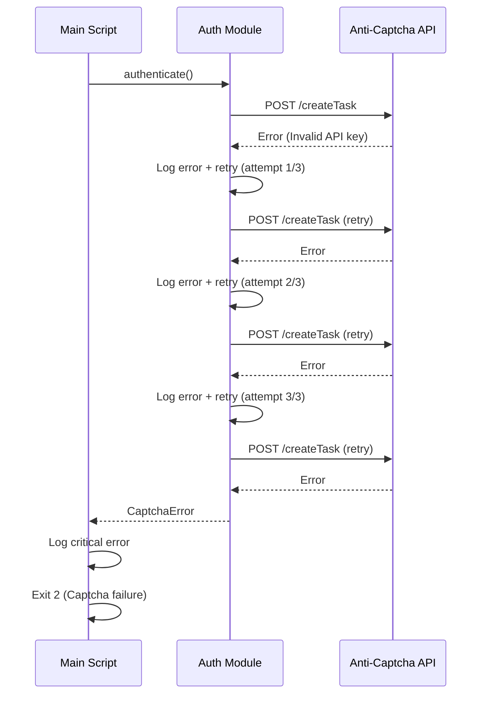

# Architecture: Gogetlinks Task Parser

## Target Architecture Constraints

| Aspect | Solution |
|--------|---------|
| **Pattern** | Simple Script (будущее масштабирование возможно) |
| **Deployment** | Direct VPS execution (No Docker for MVP) |
| **Infrastructure** | VPS (AdminVPS) + MySQL |
| **Orchestration** | Cron (native Linux) |
| **AI Integration** | N/A for MVP (future: MCP servers) |

**Note:** Хотя целевая архитектура предполагает Distributed Monolith + Coolify для сложных проектов, для данного MVP применяется упрощённая single-script модель. При необходимости масштабирования архитектура легко трансформируется в монорепо с микросервисами.

## System Overview

```
┌──────────────────────────────────────────────────────────────┐
│                      VPS (AdminVPS)                          │
│                                                              │
│  ┌────────────────────────────────────────────────────┐     │
│  │  Cron Scheduler                                    │     │
│  │  */60 * * * * /usr/bin/python3 /path/to/parser.py │     │
│  └────────────────┬───────────────────────────────────┘     │
│                   │                                          │
│  ┌────────────────▼───────────────────────────────────┐     │
│  │  gogetlinks_parser.py (Main Script)               │     │
│  │                                                    │     │
│  │  ┌──────────────┐  ┌──────────────┐              │     │
│  │  │ Auth Module  │  │ Parser Module│              │     │
│  │  └──────┬───────┘  └──────┬───────┘              │     │
│  │         │                  │                       │     │
│  │         │  ┌───────────────▼──────┐               │     │
│  │         │  │  Database Module     │               │     │
│  │         │  └───────────┬──────────┘               │     │
│  │         │              │                           │     │
│  │  ┌──────▼──────────────▼──────┐                   │     │
│  │  │  Config & Logging Layer    │                   │     │
│  │  └────────────────────────────┘                   │     │
│  └────────────────────────────────────────────────────┘     │
│                   │                     │                    │
│                   │                     │                    │
│        ┌──────────▼──────┐    ┌────────▼──────────┐        │
│        │ Selenium        │    │  MySQL Database   │        │
│        │ (Headless)      │    │  (gogetlinks)     │        │
│        └──────┬──────────┘    └───────────────────┘        │
│               │                                              │
└───────────────┼──────────────────────────────────────────────┘
                │
     ┌──────────▼──────────┐
     │  External Services  │
     │                     │
     │  ┌───────────────┐  │
     │  │ gogetlinks.net│  │
     │  └───────────────┘  │
     │  ┌───────────────┐  │
     │  │ anticaptcha   │  │
     │  │ .com          │  │
     │  └───────────────┘  │
     └─────────────────────┘
```

## Component Architecture

### 1. Main Script (gogetlinks_parser.py)

**Responsibility:** Orchestration + entry point  
**Dependencies:** All modules  
**Configuration:** config.ini

```
gogetlinks_parser.py
├── main()                  # Entry point + error handling
├── setup_environment()     # Initialize logger, config, db, driver
├── run_parsing_cycle()     # Core workflow orchestration
└── cleanup_resources()     # Close connections, log summary
```

**Key Design Decisions:**
- Single-file script (легко развернуть, минимум зависимостей)
- Exit codes для мониторинга cron
- Graceful shutdown с FINALLY блоком

### 2. Authentication Module

**Responsibility:** Login + captcha solving  
**File:** `modules/auth.py` (embedded в main для MVP)

```python
class Authenticator:
    def __init__(self, driver, config):
        self.driver = driver
        self.gogetlinks_config = config['gogetlinks']
        self.anticaptcha_config = config['anticaptcha']
    
    def authenticate(self) -> bool:
        """Main auth flow"""
        pass
    
    def is_already_authenticated(self) -> bool:
        """Check session validity"""
        pass
    
    def extract_captcha_sitekey(self) -> Optional[str]:
        """Extract reCAPTCHA sitekey from HTML"""
        pass
    
    def solve_captcha(self, sitekey: str) -> Optional[str]:
        """Call anti-captcha.com API"""
        pass
    
    def submit_login_form(self, captcha_token: Optional[str]) -> None:
        """Fill and submit login form"""
        pass
```

**External API Integration:**

```
Anti-Captcha.com API Flow:
1. POST /createTask → taskId
2. Poll GET /getTaskResult every 5s (max 120s)
3. Return gRecaptchaResponse token
```

### 3. Parser Module

**Responsibility:** HTML extraction + data cleaning  
**File:** `modules/parser.py` (embedded в main для MVP)

```python
class TaskParser:
    def __init__(self, driver):
        self.driver = driver
    
    def parse_task_list(self) -> List[Task]:
        """Parse list view (basic fields)"""
        pass
    
    def parse_task_details(self, task_id: int) -> TaskDetails:
        """Parse detail view (extended fields)"""
        pass
    
    def _extract_task_row(self, row: WebElement) -> Task:
        """Extract single task from table row"""
        pass
    
    def _clean_price(self, text: str) -> Decimal:
        """Parse price with currency removal"""
        pass
    
    def _decode_html_entities(self, text: str) -> str:
        """Convert HTML entities to UTF-8"""
        pass
```

**CSS Selectors Reference:**

| Element | Selector | Purpose |
|---------|----------|---------|
| Task row | `tr[id^='col_row_']` | Identify task rows |
| Domain | `td:nth-child(1) a` | Extract domain |
| Customer | `td:nth-child(2) a` | Extract customer |
| Price | `td:nth-child(6)` | Extract price |
| Task ID | `tr[id]` | Extract from attribute |

### 4. Database Module

**Responsibility:** MySQL CRUD operations  
**File:** `modules/database.py` (embedded в main для MVP)

```python
class TaskDatabase:
    def __init__(self, config):
        self.connection = mysql.connector.connect(
            host=config['host'],
            port=config['port'],
            database=config['database'],
            user=config['user'],
            password=config['password']
        )
    
    def ensure_schema(self) -> None:
        """Create tables if not exist"""
        pass
    
    def insert_task(self, task: Task) -> None:
        """Insert new task"""
        pass
    
    def update_task(self, task: Task) -> None:
        """Update existing task"""
        pass
    
    def task_exists(self, task_id: int) -> bool:
        """Check if task_id exists"""
        pass
    
    def get_new_tasks(self) -> List[Task]:
        """Query tasks with is_new=1"""
        pass
    
    def close(self) -> None:
        """Close connection"""
        pass
```

**Database Schema (DDL):**

```sql
CREATE TABLE tasks (
    id INT AUTO_INCREMENT PRIMARY KEY,
    task_id INT UNIQUE NOT NULL,
    title VARCHAR(500),
    description TEXT,
    price DECIMAL(10,2),
    deadline DATETIME,
    customer VARCHAR(255),
    customer_url VARCHAR(500),
    domain VARCHAR(255),
    url VARCHAR(500),
    requirements TEXT,
    contacts TEXT,
    external_links INT,
    time_passed VARCHAR(100),
    created_at TIMESTAMP DEFAULT CURRENT_TIMESTAMP,
    updated_at TIMESTAMP DEFAULT CURRENT_TIMESTAMP ON UPDATE CURRENT_TIMESTAMP,
    is_new BOOLEAN DEFAULT 1,
    
    INDEX idx_task_id (task_id),
    INDEX idx_created_at (created_at),
    INDEX idx_is_new (is_new)
) ENGINE=InnoDB DEFAULT CHARSET=utf8mb4 COLLATE=utf8mb4_unicode_ci;
```

### 5. Configuration Module

**Responsibility:** INI parsing + validation  
**File:** config.ini (data) + ConfigParser (standard lib)

**config.ini structure:**
```ini
[gogetlinks]
username = user@example.com
password = secure_password

[anticaptcha]
api_key = your_api_key_here

[database]
host = localhost
port = 3306
database = gogetlinks
user = root
password = db_password

[output]
print_tasks = true

[logging]
level = INFO
file = gogetlinks_parser.log
```

**Validation Rules:**
- All sections must exist
- Passwords must be non-empty
- API keys must be valid format (32+ chars)
- Database port must be integer

### 6. Logging Module

**Responsibility:** Structured logging  
**Implementation:** Python `logging` standard library

```python
import logging
from logging.handlers import RotatingFileHandler

def setup_logging(config):
    logger = logging.getLogger('gogetlinks_parser')
    logger.setLevel(config['logging']['level'])
    
    # File handler (with rotation)
    file_handler = RotatingFileHandler(
        config['logging']['file'],
        maxBytes=10*1024*1024,  # 10 MB
        backupCount=5
    )
    file_handler.setFormatter(
        logging.Formatter(
            '%(asctime)s - %(name)s - %(levelname)s - %(message)s'
        )
    )
    
    # Console handler
    console_handler = logging.StreamHandler()
    console_handler.setFormatter(
        logging.Formatter('%(levelname)s: %(message)s')
    )
    
    logger.addHandler(file_handler)
    logger.addHandler(console_handler)
    
    return logger
```

## Data Flow

### Happy Path Flow



### Error Flow (Captcha Failure)



## Technology Stack

### Core Technologies

| Component | Technology | Version | Rationale |
|-----------|-----------|---------|-----------|
| Language | Python | 3.8+ | Wide adoption, mature ecosystem |
| Browser Automation | Selenium WebDriver | 4.10+ | Industry standard, auto driver management |
| Browser | Chrome (Headless) | Latest | Best Selenium compatibility |
| Database | MySQL | 8.0+ | Reliable, ACID compliant |
| DB Driver | mysql-connector-python | 8.0+ | Official MySQL driver |
| Config | configparser | Stdlib | Native INI parsing |
| Logging | logging | Stdlib | Native structured logging |
| Scheduler | Cron | System | Native Linux scheduler |

### External Services

| Service | Purpose | SLA | Cost |
|---------|---------|-----|------|
| gogetlinks.net | Data source | No SLA | Free |
| anti-captcha.com | Captcha solving | 99% | $1 per 1000 captchas |

### Python Dependencies

```requirements.txt
selenium>=4.10.0
mysql-connector-python>=8.0.0
```

**Installation:**
```bash
python3 -m venv venv
source venv/bin/activate
pip install -r requirements.txt
```

## Deployment Architecture

### VPS Setup

**System Requirements:**
- OS: Ubuntu 20.04+ (or Debian 10+)
- RAM: 1GB minimum (2GB recommended)
- Disk: 10GB minimum
- Python: 3.8+
- Chrome: Latest stable

**Installation Script:**
```bash
#!/bin/bash

# Update system
sudo apt update && sudo apt upgrade -y

# Install Python
sudo apt install python3 python3-pip python3-venv -y

# Install Chrome (headless)
wget https://dl.google.com/linux/direct/google-chrome-stable_current_amd64.deb
sudo dpkg -i google-chrome-stable_current_amd64.deb || sudo apt install -f -y

# Install MySQL
sudo apt install mysql-server -y
sudo mysql_secure_installation

# Clone repository
git clone https://github.com/user/gogetlinks-parser.git
cd gogetlinks-parser

# Setup Python environment
python3 -m venv venv
source venv/bin/activate
pip install -r requirements.txt

# Copy and configure config
cp config.ini.example config.ini
nano config.ini  # Edit credentials

# Initialize database
mysql -u root -p < schema.sql

# Test run
python gogetlinks_parser.py

# Setup cron
(crontab -l 2>/dev/null; echo "0 * * * * cd /path/to/gogetlinks-parser && venv/bin/python gogetlinks_parser.py >> /var/log/gogetlinks_parser_cron.log 2>&1") | crontab -
```

### Cron Configuration

**Hourly schedule:**
```cron
# Run every hour at :00
0 * * * * cd /home/user/gogetlinks-parser && venv/bin/python gogetlinks_parser.py

# Alternative: Every 2 hours
0 */2 * * * cd /home/user/gogetlinks-parser && venv/bin/python gogetlinks_parser.py
```

**Monitoring:**
```bash
# Check cron logs
tail -f /var/log/gogetlinks_parser_cron.log

# Check parser logs
tail -f /home/user/gogetlinks-parser/gogetlinks_parser.log

# Check last exit code
echo $?
```

## Security Considerations

### 1. Credential Management

**Problem:** Plaintext credentials in config.ini  
**Mitigation (MVP):**
- File permissions: `chmod 600 config.ini`
- Owner: Script runner only
- .gitignore: `config.ini`

**Future Enhancement:**
- Encrypted credentials using Fernet (cryptography library)
- Environment variables for CI/CD
- Secret management with HashiCorp Vault

### 2. Database Access

**Problem:** Root credentials in config  
**Mitigation:**
- Create dedicated MySQL user with limited permissions
```sql
CREATE USER 'gogetlinks_parser'@'localhost' IDENTIFIED BY 'strong_password';
GRANT SELECT, INSERT, UPDATE ON gogetlinks.* TO 'gogetlinks_parser'@'localhost';
FLUSH PRIVILEGES;
```

### 3. Anti-Captcha API Key

**Problem:** API key in plaintext  
**Mitigation (MVP):**
- Same as credentials (file permissions)
- Monitor API usage for anomalies

### 4. Logging Sensitive Data

**Rule:** NEVER log passwords, API keys, or captcha tokens  
**Implementation:**
```python
logger.info("Authenticating with email: {email}".format(
    email=mask_email(config['gogetlinks']['username'])
))
# Output: "Authenticating with email: u***@example.com"
```

## Performance Characteristics

### Benchmarks (Expected)

| Metric | Value | Notes |
|--------|-------|-------|
| Auth time | 20-30s | Including captcha solving |
| Parse time (100 tasks) | 60s | List view only |
| Parse time (10 details) | 30s | Detail view |
| Database insert (100 tasks) | 2s | Batch operation |
| Total cycle (100 tasks, 10 new) | ~2-3 min | End-to-end |

### Optimization Opportunities (Future)

1. **Parallel detail parsing:** Use ThreadPoolExecutor for concurrent fetches
2. **Session persistence:** Reuse cookies to skip auth
3. **Batch database operations:** INSERT multiple rows in single query
4. **Caching:** Store parsed HTML to avoid re-fetching

## Scalability Path (Future)

### Phase 1: Current (MVP)
- Single script, single VPS
- Sequential processing
- Hourly schedule

### Phase 2: Enhanced (v1.1)
- Multi-threaded detail parsing
- Session persistence
- Every 30 minutes

### Phase 3: Distributed (v2.0)
- Multiple parser instances with Redis coordination
- Proxy rotation
- Real-time notifications

### Phase 4: Microservices (v3.0) [Future Target Architecture]
```
┌─────────────────────────────────────────────────┐
│         Coolify (Self-hosted PaaS)              │
│                                                 │
│  ┌───────────────┐  ┌────────────────┐        │
│  │ Auth Service  │  │ Parser Service │        │
│  │ (Docker)      │  │ (Docker)       │        │
│  └───────┬───────┘  └────────┬───────┘        │
│          │                   │                 │
│  ┌───────▼───────────────────▼───────┐        │
│  │      Shared Database Service       │        │
│  │      (PostgreSQL in Docker)        │        │
│  └────────────────────────────────────┘        │
│                                                 │
│  ┌────────────────────────────────────┐        │
│  │      MCP Server (AI Integration)   │        │
│  └────────────────────────────────────┘        │
└─────────────────────────────────────────────────┘
```

**Note:** Текущая MVP-архитектура позволяет постепенную миграцию к Distributed Monolith без полной переписывания кода.

## Monitoring & Observability

### Metrics to Track (Future)

| Metric | Source | Alert Threshold |
|--------|--------|-----------------|
| Successful parses | Exit code 0 | < 90% over 24h |
| Captcha failures | Exit code 2 | > 5 in 24h |
| Database errors | Exit code 4 | Any occurrence |
| Average cycle time | Log parsing | > 10 minutes |
| New tasks per day | Database query | Trend analysis |

### Log Analysis

```bash
# Count errors in last 24 hours
grep -c "ERROR" gogetlinks_parser.log

# Check exit codes
grep -E "Exit code: [^0]" gogetlinks_parser_cron.log

# Find slow cycles
grep "Total execution time" gogetlinks_parser.log | awk '{print $NF}' | sort -nr | head
```

---

**Architecture Version:** 1.0 (MVP)  
**Target Evolution:** Simple Script → Distributed Monolith (when needed)  
**Current Focus:** Reliability + Simplicity  
**Future Focus:** Scalability + Real-time Processing
