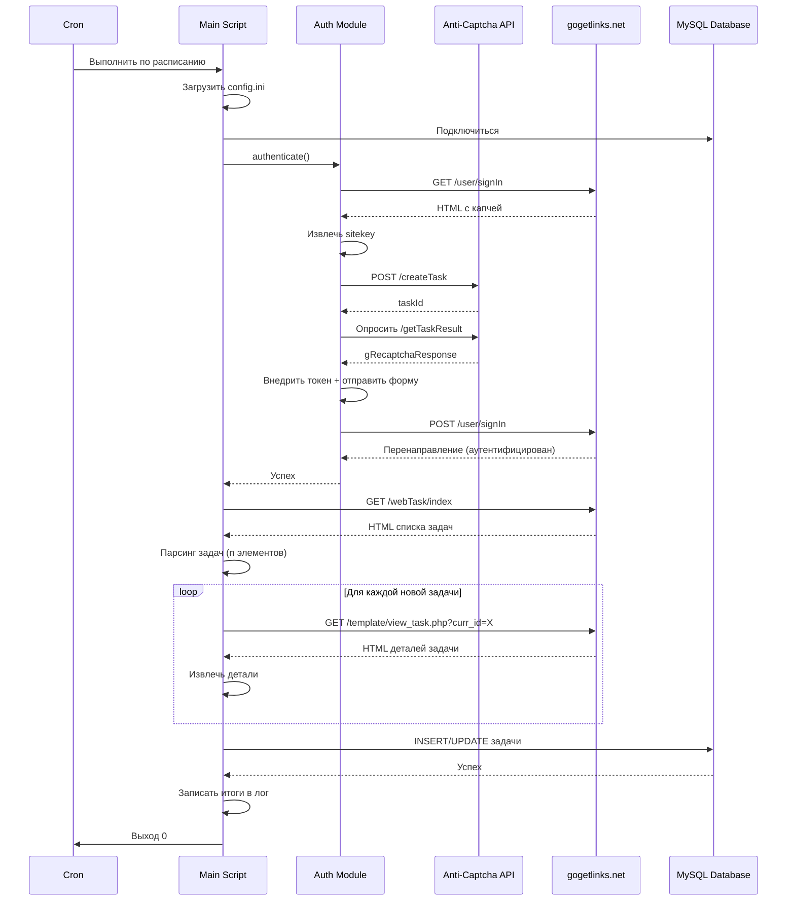
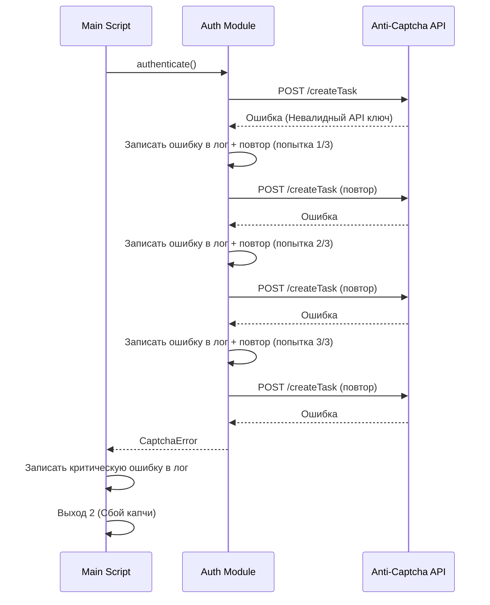

# Архитектура: Gogetlinks Task Parser

## Ограничения целевой архитектуры

| Аспект | Решение |
|--------|---------|
| **Паттерн** | Simple Script (будущее масштабирование возможно) |
| **Развертывание** | Прямое выполнение на VPS (No Docker for MVP) |
| **Инфраструктура** | VPS (AdminVPS) + MySQL |
| **Оркестрация** | Cron (native Linux) |
| **AI интеграция** | N/A для MVP (будущее: MCP servers) |

**Примечание:** Хотя целевая архитектура предполагает Distributed Monolith + Coolify для сложных проектов, для данного MVP применяется упрощённая single-script модель. При необходимости масштабирования архитектура легко трансформируется в монорепо с микросервисами.

## Обзор системы

```
┌──────────────────────────────────────────────────────────────┐
│                      VPS (AdminVPS)                          │
│                                                              │
│  ┌────────────────────────────────────────────────────┐     │
│  │  Cron Scheduler                                    │     │
│  │  */60 * * * * /usr/bin/python3 /path/to/parser.py │     │
│  └────────────────┬───────────────────────────────────┘     │
│                   │                                          │
│  ┌────────────────▼───────────────────────────────────┐     │
│  │  gogetlinks_parser.py (Main Script)               │     │
│  │                                                    │     │
│  │  ┌──────────────┐  ┌──────────────┐              │     │
│  │  │ Auth Module  │  │ Parser Module│              │     │
│  │  └──────┬───────┘  └──────┬───────┘              │     │
│  │         │                  │                       │     │
│  │         │  ┌───────────────▼──────┐               │     │
│  │         │  │  Database Module     │               │     │
│  │         │  └───────────┬──────────┘               │     │
│  │         │              │                           │     │
│  │  ┌──────▼──────────────▼──────┐                   │     │
│  │  │  Config & Logging Layer    │                   │     │
│  │  └────────────────────────────┘                   │     │
│  └────────────────────────────────────────────────────┘     │
│                   │                     │                    │
│                   │                     │                    │
│        ┌──────────▼──────┐    ┌────────▼──────────┐        │
│        │ Selenium        │    │  MySQL Database   │        │
│        │ (Headless)      │    │  (gogetlinks)     │        │
│        └──────┬──────────┘    └───────────────────┘        │
│               │                                              │
└───────────────┼──────────────────────────────────────────────┘
                │
     ┌──────────▼──────────┐
     │  External Services  │
     │                     │
     │  ┌───────────────┐  │
     │  │ gogetlinks.net│  │
     │  └───────────────┘  │
     │  ┌───────────────┐  │
     │  │ anticaptcha   │  │
     │  │ .com          │  │
     │  └───────────────┘  │
     └─────────────────────┘
```

## Архитектура компонентов

### 1. Главный скрипт (gogetlinks_parser.py)

**Ответственность:** Оркестрация + точка входа
**Зависимости:** Все модули
**Конфигурация:** config.ini

```
gogetlinks_parser.py
├── main()                  # Точка входа + обработка ошибок
├── setup_environment()     # Инициализация logger, config, db, driver
├── run_parsing_cycle()     # Оркестрация основного рабочего процесса
└── cleanup_resources()     # Закрытие соединений, запись итоговых логов
```

**Ключевые проектные решения:**
- Скрипт в одном файле (легко развернуть, минимум зависимостей)
- Коды выхода для мониторинга cron
- Graceful shutdown с FINALLY блоком

### 2. Модуль аутентификации

**Ответственность:** Вход + решение капчи
**Файл:** `modules/auth.py` (embedded в main для MVP)

```python
class Authenticator:
    def __init__(self, driver, config):
        self.driver = driver
        self.gogetlinks_config = config['gogetlinks']
        self.anticaptcha_config = config['anticaptcha']

    def authenticate(self) -> bool:
        """Основной процесс аутентификации"""
        pass

    def is_already_authenticated(self) -> bool:
        """Проверка валидности сессии"""
        pass

    def extract_captcha_sitekey(self) -> Optional[str]:
        """Извлечение reCAPTCHA sitekey из HTML"""
        pass

    def solve_captcha(self, sitekey: str) -> Optional[str]:
        """Вызов anti-captcha.com API"""
        pass

    def submit_login_form(self, captcha_token: Optional[str]) -> None:
        """Заполнение и отправка формы входа"""
        pass
```

**Интеграция с внешним API:**

```
Процесс Anti-Captcha.com API:
1. POST /createTask → taskId
2. Опрос GET /getTaskResult каждые 5с (макс 120с)
3. Возврат токена gRecaptchaResponse
```

### 3. Модуль парсера

**Ответственность:** Извлечение HTML + очистка данных
**Файл:** `modules/parser.py` (embedded в main для MVP)

```python
class TaskParser:
    def __init__(self, driver):
        self.driver = driver

    def parse_task_list(self) -> List[Task]:
        """Парсинг представления списка (базовые поля)"""
        pass

    def parse_task_details(self, task_id: int) -> TaskDetails:
        """Парсинг детального представления (расширенные поля)"""
        pass

    def _extract_task_row(self, row: WebElement) -> Task:
        """Извлечение одной задачи из строки таблицы"""
        pass

    def _clean_price(self, text: str) -> Decimal:
        """Парсинг цены с удалением валюты"""
        pass

    def _decode_html_entities(self, text: str) -> str:
        """Конвертация HTML сущностей в UTF-8"""
        pass
```

**Справочник CSS селекторов:**

| Элемент | Селектор | Назначение |
|---------|----------|---------|
| Строка задачи | `tr[id^='col_row_']` | Идентификация строк задач |
| Домен | `td:nth-child(1) a` | Извлечение домена |
| Заказчик | `td:nth-child(2) a` | Извлечение заказчика |
| Цена | `td:nth-child(6)` | Извлечение цены |
| ID задачи | `tr[id]` | Извлечение из атрибута |

### 4. Модуль базы данных

**Ответственность:** MySQL CRUD операции
**Файл:** `modules/database.py` (embedded в main для MVP)

```python
class TaskDatabase:
    def __init__(self, config):
        self.connection = mysql.connector.connect(
            host=config['host'],
            port=config['port'],
            database=config['database'],
            user=config['user'],
            password=config['password']
        )

    def ensure_schema(self) -> None:
        """Создание таблиц если не существуют"""
        pass

    def insert_task(self, task: Task) -> None:
        """Вставка новой задачи"""
        pass

    def update_task(self, task: Task) -> None:
        """Обновление существующей задачи"""
        pass

    def task_exists(self, task_id: int) -> bool:
        """Проверка существования task_id"""
        pass

    def get_new_tasks(self) -> List[Task]:
        """Запрос задач с is_new=1"""
        pass

    def close(self) -> None:
        """Закрытие соединения"""
        pass
```

**Схема базы данных (DDL):**

```sql
CREATE TABLE tasks (
    id INT AUTO_INCREMENT PRIMARY KEY,
    task_id INT UNIQUE NOT NULL,
    title VARCHAR(500),
    description TEXT,
    price DECIMAL(10,2),
    deadline DATETIME,
    customer VARCHAR(255),
    customer_url VARCHAR(500),
    domain VARCHAR(255),
    url VARCHAR(500),
    requirements TEXT,
    contacts TEXT,
    external_links INT,
    time_passed VARCHAR(100),
    created_at TIMESTAMP DEFAULT CURRENT_TIMESTAMP,
    updated_at TIMESTAMP DEFAULT CURRENT_TIMESTAMP ON UPDATE CURRENT_TIMESTAMP,
    is_new BOOLEAN DEFAULT 1,

    INDEX idx_task_id (task_id),
    INDEX idx_created_at (created_at),
    INDEX idx_is_new (is_new)
) ENGINE=InnoDB DEFAULT CHARSET=utf8mb4 COLLATE=utf8mb4_unicode_ci;
```

### 5. Модуль конфигурации

**Ответственность:** Парсинг INI + валидация
**Файл:** config.ini (данные) + ConfigParser (стандартная библиотека)

**Структура config.ini:**
```ini
[gogetlinks]
username = user@example.com
password = secure_password

[anticaptcha]
api_key = your_api_key_here

[database]
host = localhost
port = 3306
database = gogetlinks
user = root
password = db_password

[output]
print_tasks = true

[logging]
level = INFO
file = gogetlinks_parser.log
```

**Правила валидации:**
- Все секции должны существовать
- Пароли должны быть непустыми
- API ключи должны иметь валидный формат (32+ символов)
- Порт базы данных должен быть целым числом

### 6. Модуль логирования

**Ответственность:** Структурированное логирование
**Реализация:** Стандартная библиотека Python `logging`

```python
import logging
from logging.handlers import RotatingFileHandler

def setup_logging(config):
    logger = logging.getLogger('gogetlinks_parser')
    logger.setLevel(config['logging']['level'])

    # Обработчик файла (с ротацией)
    file_handler = RotatingFileHandler(
        config['logging']['file'],
        maxBytes=10*1024*1024,  # 10 MB
        backupCount=5
    )
    file_handler.setFormatter(
        logging.Formatter(
            '%(asctime)s - %(name)s - %(levelname)s - %(message)s'
        )
    )

    # Обработчик консоли
    console_handler = logging.StreamHandler()
    console_handler.setFormatter(
        logging.Formatter('%(levelname)s: %(message)s')
    )

    logger.addHandler(file_handler)
    logger.addHandler(console_handler)

    return logger
```

## Поток данных

### Основной поток работы



### Поток при ошибке (сбой капчи)



## Технологический стек

### Основные технологии

| Компонент | Технология | Версия | Обоснование |
|-----------|-----------|---------|-----------|
| Язык | Python | 3.8+ | Широкое распространение, зрелая экосистема |
| Автоматизация браузера | Selenium WebDriver | 4.10+ | Индустриальный стандарт, автоматическое управление драйверами |
| Браузер | Chrome (Headless) | Последняя | Лучшая совместимость с Selenium |
| База данных | MySQL | 8.0+ | Надежная, соответствие ACID |
| Драйвер БД | mysql-connector-python | 8.0+ | Официальный драйвер MySQL |
| Конфигурация | configparser | Stdlib | Встроенный парсинг INI |
| Логирование | logging | Stdlib | Встроенное структурированное логирование |
| Планировщик | Cron | System | Встроенный планировщик Linux |

### Внешние сервисы

| Сервис | Назначение | SLA | Стоимость |
|---------|---------|-----|------|
| gogetlinks.net | Источник данных | Без SLA | Бесплатно |
| anti-captcha.com | Решение капчи | 99% | $1 за 1000 капч |

### Зависимости Python

```requirements.txt
selenium>=4.10.0
mysql-connector-python>=8.0.0
```

**Установка:**
```bash
python3 -m venv venv
source venv/bin/activate
pip install -r requirements.txt
```

## Архитектура развертывания

### Настройка VPS

**Системные требования:**
- ОС: Ubuntu 20.04+ (или Debian 10+)
- RAM: минимум 1GB (рекомендуется 2GB)
- Диск: минимум 10GB
- Python: 3.8+
- Chrome: Последняя стабильная версия

**Скрипт установки:**
```bash
#!/bin/bash

# Обновить систему
sudo apt update && sudo apt upgrade -y

# Установить Python
sudo apt install python3 python3-pip python3-venv -y

# Установить Chrome (headless)
wget https://dl.google.com/linux/direct/google-chrome-stable_current_amd64.deb
sudo dpkg -i google-chrome-stable_current_amd64.deb || sudo apt install -f -y

# Установить MySQL
sudo apt install mysql-server -y
sudo mysql_secure_installation

# Клонировать репозиторий
git clone https://github.com/user/gogetlinks-parser.git
cd gogetlinks-parser

# Настроить окружение Python
python3 -m venv venv
source venv/bin/activate
pip install -r requirements.txt

# Скопировать и настроить конфигурацию
cp config.ini.example config.ini
nano config.ini  # Редактировать учетные данные

# Инициализировать базу данных
mysql -u root -p < schema.sql

# Тестовый запуск
python gogetlinks_parser.py

# Настроить cron
(crontab -l 2>/dev/null; echo "0 * * * * cd /path/to/gogetlinks-parser && venv/bin/python gogetlinks_parser.py >> /var/log/gogetlinks_parser_cron.log 2>&1") | crontab -
```

### Конфигурация Cron

**Ежечасное расписание:**
```cron
# Запуск каждый час в :00
0 * * * * cd /home/user/gogetlinks-parser && venv/bin/python gogetlinks_parser.py

# Альтернатива: Каждые 2 часа
0 */2 * * * cd /home/user/gogetlinks-parser && venv/bin/python gogetlinks_parser.py
```

**Мониторинг:**
```bash
# Проверить логи cron
tail -f /var/log/gogetlinks_parser_cron.log

# Проверить логи парсера
tail -f /home/user/gogetlinks-parser/gogetlinks_parser.log

# Проверить последний код выхода
echo $?
```

## Соображения безопасности

### 1. Управление учетными данными

**Проблема:** Учетные данные в открытом виде в config.ini
**Меры защиты (MVP):**
- Права доступа к файлу: `chmod 600 config.ini`
- Владелец: Только пользователь, запускающий скрипт
- .gitignore: `config.ini`

**Будущие улучшения:**
- Шифрование учетных данных с использованием Fernet (библиотека cryptography)
- Переменные окружения для CI/CD
- Управление секретами с HashiCorp Vault

### 2. Доступ к базе данных

**Проблема:** Учетные данные root в конфигурации
**Меры защиты:**
- Создать выделенного пользователя MySQL с ограниченными правами
```sql
CREATE USER 'gogetlinks_parser'@'localhost' IDENTIFIED BY 'strong_password';
GRANT SELECT, INSERT, UPDATE ON gogetlinks.* TO 'gogetlinks_parser'@'localhost';
FLUSH PRIVILEGES;
```

### 3. API ключ Anti-Captcha

**Проблема:** API ключ в открытом виде
**Меры защиты (MVP):**
- Те же, что и для учетных данных (права доступа к файлу)
- Мониторинг использования API на предмет аномалий

### 4. Логирование чувствительных данных

**Правило:** НИКОГДА не логировать пароли, API ключи или токены капчи
**Реализация:**
```python
logger.info("Аутентификация с email: {email}".format(
    email=mask_email(config['gogetlinks']['username'])
))
# Вывод: "Аутентификация с email: u***@example.com"
```

## Характеристики производительности

### Бенчмарки (ожидаемые)

| Метрика | Значение | Примечания |
|--------|-------|-------|
| Время аутентификации | 20-30с | Включая решение капчи |
| Время парсинга (100 задач) | 60с | Только представление списка |
| Время парсинга (10 деталей) | 30с | Детальное представление |
| Вставка в БД (100 задач) | 2с | Пакетная операция |
| Полный цикл (100 задач, 10 новых) | ~2-3 мин | От начала до конца |

### Возможности оптимизации (будущее)

1. **Параллельный парсинг деталей:** Использовать ThreadPoolExecutor для конкурентных запросов
2. **Сохранение сессии:** Переиспользовать cookies для пропуска аутентификации
3. **Пакетные операции с БД:** INSERT нескольких строк в одном запросе
4. **Кеширование:** Хранить спарсенный HTML для избежания повторного получения

## Путь масштабирования (будущее)

### Фаза 1: Текущая (MVP)
- Один скрипт, один VPS
- Последовательная обработка
- Ежечасное расписание

### Фаза 2: Улучшенная (v1.1)
- Многопоточный парсинг деталей
- Сохранение сессии
- Каждые 30 минут

### Фаза 3: Распределенная (v2.0)
- Несколько экземпляров парсера с координацией через Redis
- Ротация прокси
- Уведомления в реальном времени

### Фаза 4: Микросервисы (v3.0) [Будущая целевая архитектура]
```
┌─────────────────────────────────────────────────┐
│         Coolify (Self-hosted PaaS)              │
│                                                 │
│  ┌───────────────┐  ┌────────────────┐        │
│  │ Auth Service  │  │ Parser Service │        │
│  │ (Docker)      │  │ (Docker)       │        │
│  └───────┬───────┘  └────────┬───────┘        │
│          │                   │                 │
│  ┌───────▼───────────────────▼───────┐        │
│  │      Shared Database Service       │        │
│  │      (PostgreSQL in Docker)        │        │
│  └────────────────────────────────────┘        │
│                                                 │
│  ┌────────────────────────────────────┐        │
│  │      MCP Server (AI Integration)   │        │
│  └────────────────────────────────────┘        │
└─────────────────────────────────────────────────┘
```

**Примечание:** Текущая MVP-архитектура позволяет постепенную миграцию к Distributed Monolith без полной переписывания кода.

## Мониторинг и наблюдаемость

### Метрики для отслеживания (будущее)

| Метрика | Источник | Порог для оповещения |
|--------|--------|-----------------|
| Успешные парсинги | Код выхода 0 | < 90% за 24ч |
| Сбои капчи | Код выхода 2 | > 5 за 24ч |
| Ошибки базы данных | Код выхода 4 | Любое возникновение |
| Среднее время цикла | Парсинг логов | > 10 минут |
| Новых задач в день | Запрос к БД | Анализ тренда |

### Анализ логов

```bash
# Подсчитать ошибки за последние 24 часа
grep -c "ERROR" gogetlinks_parser.log

# Проверить коды выхода
grep -E "Exit code: [^0]" gogetlinks_parser_cron.log

# Найти медленные циклы
grep "Total execution time" gogetlinks_parser.log | awk '{print $NF}' | sort -nr | head
```

---

**Версия архитектуры:** 1.0 (MVP)
**Целевая эволюция:** Simple Script → Distributed Monolith (при необходимости)
**Текущий фокус:** Надежность + Простота
**Будущий фокус:** Масштабируемость + Обработка в реальном времени
