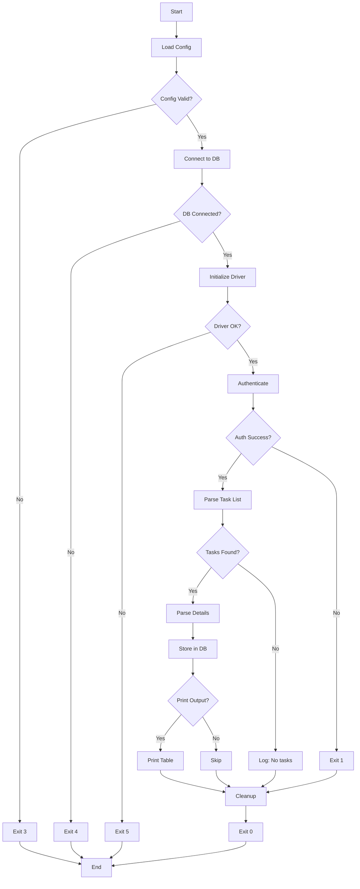

# Pseudocode: Gogetlinks Task Parser

## Main Program Flow

```pseudocode
FUNCTION main():
    // === SETUP PHASE ===
    logger = initialize_logger(config.logging)
    LOG INFO "Starting Gogetlinks Task Parser v1.0"
    
    TRY:
        config = load_config("config.ini")
        VALIDATE config.required_fields
        LOG INFO "Configuration loaded successfully"
    CATCH ConfigError as e:
        LOG ERROR "Config error: {e}"
        EXIT 3
    
    // === DATABASE INITIALIZATION ===
    TRY:
        db = connect_to_database(config.database)
        ensure_schema_exists(db)
        LOG INFO "Database connection established"
    CATCH DatabaseError as e:
        LOG ERROR "Database error: {e}"
        EXIT 4
    
    // === BROWSER INITIALIZATION ===
    TRY:
        driver = initialize_selenium_driver(headless=True)
        LOG INFO "Browser driver initialized"
    CATCH WebDriverException as e:
        LOG ERROR "WebDriver error: {e}"
        EXIT 5
    
    // === MAIN WORKFLOW ===
    TRY:
        // Step 1: Authentication
        is_authenticated = authenticate(driver, config.gogetlinks, config.anticaptcha)
        IF NOT is_authenticated:
            LOG ERROR "Authentication failed"
            EXIT 1
        
        // Step 2: Parse tasks
        tasks = parse_task_list(driver)
        LOG INFO "Found {len(tasks)} tasks"
        
        // Step 3: Get details for new tasks
        IF config.parse_details:
            FOR EACH task IN tasks:
                IF NOT task_exists_in_db(db, task.task_id):
                    details = parse_task_details(driver, task.task_id)
                    task.merge(details)
        
        // Step 4: Store in database
        new_count = 0
        updated_count = 0
        FOR EACH task IN tasks:
            IF task_exists_in_db(db, task.task_id):
                update_task(db, task)
                updated_count++
            ELSE:
                insert_task(db, task)
                new_count++
        
        LOG INFO "Processed: {new_count} new, {updated_count} updated"
        
        // Step 5: Output to console (if enabled)
        IF config.output.print_tasks:
            print_tasks_table(tasks)
        
        LOG INFO "Parsing completed successfully"
        EXIT 0
        
    CATCH Exception as e:
        LOG ERROR "Unexpected error: {e}"
        LOG ERROR traceback.format_exc()
        EXIT 99
        
    FINALLY:
        driver.quit()
        db.close()
        LOG INFO "Resources cleaned up"
END FUNCTION
```

## Authentication Module

### authenticate(driver, credentials, anticaptcha_config)

```pseudocode
FUNCTION authenticate(driver, credentials, anticaptcha_config) -> Boolean:
    LOG INFO "Starting authentication"
    
    // Navigate to login page
    driver.get("https://gogetlinks.net/user/signIn")
    WAIT FOR page_load(timeout=10)
    
    // Check if already authenticated
    html = driver.page_source
    IF is_authenticated_markup(html):
        LOG INFO "Already authenticated (session valid)"
        RETURN True
    
    // Extract captcha sitekey
    TRY:
        captcha_element = driver.find_element(By.CSS_SELECTOR, "[data-sitekey]")
        sitekey = captcha_element.get_attribute("data-sitekey")
        LOG INFO "Captcha sitekey extracted: {sitekey}"
    CATCH NoSuchElementException:
        LOG WARNING "No captcha found on page"
        sitekey = None
    
    // Solve captcha (if present)
    captcha_token = None
    IF sitekey IS NOT None:
        TRY:
            captcha_token = solve_captcha(
                api_key=anticaptcha_config.api_key,
                website_url="https://gogetlinks.net/user/signIn",
                sitekey=sitekey,
                max_attempts=3
            )
            LOG INFO "Captcha solved successfully"
        CATCH CaptchaError as e:
            LOG ERROR "Captcha solving failed: {e}"
            RETURN False
    
    // Fill login form
    TRY:
        email_field = WAIT FOR element(By.CSS_SELECTOR, "input[name='e_mail']", timeout=5)
        password_field = driver.find_element(By.CSS_SELECTOR, "input[name='password']")
        
        email_field.send_keys(credentials.username)
        password_field.send_keys(credentials.password)
        
        LOG INFO "Login form filled"
    CATCH NoSuchElementException as e:
        LOG ERROR "Login form fields not found: {e}"
        RETURN False
    
    // Inject captcha token (if solved)
    IF captcha_token IS NOT None:
        driver.execute_script(
            "document.getElementById('g-recaptcha-response').innerHTML = arguments[0];",
            captcha_token
        )
    
    // Submit form
    submit_button = driver.find_element(By.CSS_SELECTOR, "button[type='submit']")
    submit_button.click()
    
    // Wait for redirect and verify
    SLEEP 3
    html = driver.page_source
    
    IF is_authenticated_markup(html):
        LOG INFO "Authentication successful"
        RETURN True
    ELSE:
        LOG ERROR "Authentication failed (incorrect credentials or captcha)"
        RETURN False
END FUNCTION

FUNCTION is_authenticated_markup(html: String) -> Boolean:
    RETURN (
        "href=\"/profile\"" IN html AND
        "Выйти" IN html
    )
END FUNCTION
```

### solve_captcha(api_key, website_url, sitekey, max_attempts)

```pseudocode
FUNCTION solve_captcha(api_key, website_url, sitekey, max_attempts=3) -> String:
    """
    Solve reCAPTCHA v2 using anti-captcha.com API
    Returns: Captcha token string
    Raises: CaptchaError on failure
    """
    FOR attempt IN range(1, max_attempts + 1):
        TRY:
            LOG INFO "Captcha solve attempt {attempt}/{max_attempts}"
            
            // Create task
            payload = {
                "clientKey": api_key,
                "task": {
                    "type": "NoCaptchaTaskProxyless",
                    "websiteURL": website_url,
                    "websiteKey": sitekey
                }
            }
            
            response = POST "https://api.anti-captcha.com/createTask"
                WITH json=payload
            
            IF response.status_code != 200:
                RAISE CaptchaError("API request failed")
            
            data = response.json()
            IF data.errorId != 0:
                RAISE CaptchaError(data.errorDescription)
            
            task_id = data.taskId
            LOG INFO "Task created: {task_id}"
            
            // Poll for solution (max 120 seconds)
            start_time = NOW()
            WHILE (NOW() - start_time) < 120:
                SLEEP 5
                
                poll_payload = {
                    "clientKey": api_key,
                    "taskId": task_id
                }
                
                poll_response = POST "https://api.anti-captcha.com/getTaskResult"
                    WITH json=poll_payload
                
                poll_data = poll_response.json()
                
                IF poll_data.status == "ready":
                    token = poll_data.solution.gRecaptchaResponse
                    LOG INFO "Captcha solved"
                    RETURN token
                
                ELSE IF poll_data.status == "processing":
                    CONTINUE
                
                ELSE:
                    RAISE CaptchaError("Unknown status: {poll_data.status}")
            
            // Timeout reached
            RAISE CaptchaError("Timeout waiting for captcha solution")
            
        CATCH CaptchaError as e:
            LOG WARNING "Attempt {attempt} failed: {e}"
            IF attempt == max_attempts:
                RAISE CaptchaError("All captcha solve attempts failed")
            SLEEP 10  // Backoff before retry
    
END FUNCTION
```

## Parser Module

### parse_task_list(driver)

```pseudocode
FUNCTION parse_task_list(driver) -> List[Task]:
    LOG INFO "Navigating to task list"
    
    driver.get("https://gogetlinks.net/webTask/index")
    
    // Wait for task table to load
    TRY:
        WAIT FOR presence_of_elements(
            By.CSS_SELECTOR,
            "tr[id^='col_row_']",
            timeout=10
        )
    CATCH TimeoutException:
        LOG WARNING "No tasks found (table not loaded)"
        RETURN []
    
    // Extract task rows
    task_rows = driver.find_elements(By.CSS_SELECTOR, "tr[id^='col_row_']")
    LOG INFO "Found {len(task_rows)} task rows"
    
    tasks = []
    FOR EACH row IN task_rows:
        TRY:
            task = parse_task_row(row)
            tasks.append(task)
        CATCH Exception as e:
            LOG WARNING "Failed to parse task row: {e}"
            CONTINUE
    
    RETURN tasks
END FUNCTION

FUNCTION parse_task_row(row: WebElement) -> Task:
    // Extract task_id from row ID attribute
    row_id = row.get_attribute("id")
    task_id = EXTRACT_INTEGER(row_id, pattern="col_row_(\d+)")
    
    // Extract table cells
    cells = row.find_elements(By.TAG_NAME, "td")
    IF len(cells) < 6:
        RAISE ValueError("Incomplete task row")
    
    // Parse domain (cell 0)
    domain_link = cells[0].find_element(By.TAG_NAME, "a")
    domain = domain_link.text.strip()
    
    // Parse customer (cell 1)
    customer_link = cells[1].find_element(By.TAG_NAME, "a")
    customer = customer_link.text.strip()
    customer_url = customer_link.get_attribute("href")
    
    // Parse external links (cell 2)
    external_links = PARSE_INT(cells[2].text.strip(), default=0)
    
    // Parse time passed (cell 4)
    time_passed = cells[4].text.strip()
    
    // Parse price (cell 5)
    price_text = cells[5].text.strip()
    price = PARSE_DECIMAL(price_text, default=0.0)
    
    RETURN Task(
        task_id=task_id,
        domain=domain,
        customer=customer,
        customer_url=customer_url,
        external_links=external_links,
        time_passed=time_passed,
        price=price
    )
END FUNCTION
```

### parse_task_details(driver, task_id)

```pseudocode
FUNCTION parse_task_details(driver, task_id: Integer) -> TaskDetails:
    LOG INFO "Fetching details for task {task_id}"
    
    url = f"https://gogetlinks.net/template/view_task.php?curr_id={task_id}"
    driver.get(url)
    
    WAIT FOR page_load(timeout=10)
    html = driver.page_source
    
    // Convert encoding if needed
    html = DECODE(html, from="windows-1251", to="utf-8")
    
    details = TaskDetails()
    
    // Extract title
    TRY:
        title_element = driver.find_element(By.CSS_SELECTOR, "h1.task-title")
        details.title = title_element.text.strip()
    CATCH NoSuchElementException:
        details.title = None
    
    // Extract description
    description_pattern = r"Текст задания</div>.+?block_value\">(.+?)</div>"
    match = REGEX_SEARCH(description_pattern, html, flags=DOTALL)
    IF match:
        details.description = HTML_UNESCAPE(match.group(1))
    
    // Extract requirements
    requirements_pattern = r"Требования</div>.+?block_value\">(.+?)</div>"
    match = REGEX_SEARCH(requirements_pattern, html, flags=DOTALL)
    IF match:
        details.requirements = HTML_UNESCAPE(match.group(1))
    
    // Extract URL
    TRY:
        url_input = driver.find_element(By.ID, "copy_url")
        details.url = url_input.get_attribute("value")
    CATCH NoSuchElementException:
        details.url = None
    
    // Extract anchor
    TRY:
        anchor_input = driver.find_element(By.ID, "copy_unhor")
        details.anchor = anchor_input.get_attribute("value")
    CATCH NoSuchElementException:
        details.anchor = None
    
    // Extract source
    TRY:
        source_input = driver.find_element(By.ID, "copy_source")
        details.source = source_input.get_attribute("value")
    CATCH NoSuchElementException:
        details.source = None
    
    // Extract contacts (if present)
    contacts_pattern = r"Контакты</div>.+?block_value\">(.+?)</div>"
    match = REGEX_SEARCH(contacts_pattern, html, flags=DOTALL)
    IF match:
        details.contacts = HTML_UNESCAPE(match.group(1))
    
    LOG INFO "Details extracted for task {task_id}"
    RETURN details
END FUNCTION
```

## Database Module

### insert_task(db, task)

```pseudocode
FUNCTION insert_task(db: Connection, task: Task) -> None:
    query = """
        INSERT INTO tasks (
            task_id, title, description, price, deadline,
            customer, customer_url, domain, url,
            requirements, contacts, external_links,
            time_passed, is_new, created_at
        ) VALUES (
            %s, %s, %s, %s, %s, %s, %s, %s, %s, %s, %s, %s, %s, %s, NOW()
        )
    """
    
    values = (
        task.task_id,
        task.title,
        task.description,
        task.price,
        task.deadline,
        task.customer,
        task.customer_url,
        task.domain,
        task.url,
        task.requirements,
        task.contacts,
        task.external_links,
        task.time_passed,
        1  // is_new = True
    )
    
    TRY:
        cursor = db.cursor()
        cursor.execute(query, values)
        db.commit()
        LOG INFO "Inserted task {task.task_id}"
    CATCH IntegrityError as e:
        LOG WARNING "Duplicate task_id {task.task_id} (race condition)"
        db.rollback()
    CATCH DatabaseError as e:
        LOG ERROR "Database error inserting task: {e}"
        db.rollback()
        RAISE
END FUNCTION

FUNCTION update_task(db: Connection, task: Task) -> None:
    query = """
        UPDATE tasks SET
            title = %s,
            description = %s,
            price = %s,
            deadline = %s,
            customer = %s,
            customer_url = %s,
            domain = %s,
            url = %s,
            requirements = %s,
            contacts = %s,
            external_links = %s,
            time_passed = %s,
            is_new = 0,
            updated_at = NOW()
        WHERE task_id = %s
    """
    
    values = (
        task.title, task.description, task.price, task.deadline,
        task.customer, task.customer_url, task.domain, task.url,
        task.requirements, task.contacts, task.external_links,
        task.time_passed, task.task_id
    )
    
    TRY:
        cursor = db.cursor()
        cursor.execute(query, values)
        db.commit()
        LOG INFO "Updated task {task.task_id}"
    CATCH DatabaseError as e:
        LOG ERROR "Database error updating task: {e}"
        db.rollback()
        RAISE
END FUNCTION

FUNCTION task_exists_in_db(db: Connection, task_id: Integer) -> Boolean:
    query = "SELECT 1 FROM tasks WHERE task_id = %s LIMIT 1"
    cursor = db.cursor()
    cursor.execute(query, (task_id,))
    result = cursor.fetchone()
    RETURN result IS NOT None
END FUNCTION
```

## Utility Functions

### Data Cleaning

```pseudocode
FUNCTION PARSE_INT(text: String, default: Integer = 0) -> Integer:
    TRY:
        RETURN INTEGER(text)
    CATCH ValueError:
        RETURN default
END FUNCTION

FUNCTION PARSE_DECIMAL(text: String, default: Decimal = 0.0) -> Decimal:
    // Remove non-numeric characters except . and ,
    cleaned = REMOVE_ALL(text, except="0-9.,")
    cleaned = REPLACE(cleaned, ",", ".")
    
    TRY:
        RETURN DECIMAL(cleaned)
    CATCH ValueError:
        RETURN default
END FUNCTION

FUNCTION HTML_UNESCAPE(text: String) -> String:
    // Convert HTML entities to characters
    // &nbsp; → space
    // &lt; → <
    // &gt; → >
    // etc.
    RETURN html.unescape(text)
END FUNCTION

FUNCTION EXTRACT_INTEGER(text: String, pattern: String) -> Integer:
    match = REGEX_SEARCH(pattern, text)
    IF match:
        RETURN INTEGER(match.group(1))
    ELSE:
        RAISE ValueError("No match found for pattern")
END FUNCTION
```

## Data Structures

```pseudocode
CLASS Task:
    ATTRIBUTES:
        task_id: Integer
        title: String (nullable)
        description: String (nullable)
        price: Decimal (nullable)
        deadline: DateTime (nullable)
        customer: String (nullable)
        customer_url: String (nullable)
        domain: String (nullable)
        url: String (nullable)
        requirements: String (nullable)
        contacts: String (nullable)
        external_links: Integer (nullable)
        time_passed: String (nullable)
    
    METHOD merge(details: TaskDetails):
        // Merge detail fields into this task
        IF details.title IS NOT None:
            this.title = details.title
        IF details.description IS NOT None:
            this.description = details.description
        // ... etc for all detail fields
END CLASS

CLASS TaskDetails:
    ATTRIBUTES:
        title: String (nullable)
        description: String (nullable)
        requirements: String (nullable)
        url: String (nullable)
        anchor: String (nullable)
        source: String (nullable)
        contacts: String (nullable)
END CLASS
```

## Error Handling Strategy

```pseudocode
HIERARCHY OF EXCEPTIONS:

Exception
├── ConfigError            → Exit code 3
├── DatabaseError          → Exit code 4
│   ├── ConnectionError
│   └── IntegrityError
├── WebDriverException     → Exit code 5
│   ├── TimeoutException
│   ├── NoSuchElementException
│   └── StaleElementReferenceException
└── CaptchaError          → Exit code 2

HANDLING RULES:
- Authentication failures → Exit code 1
- Captcha failures → Exit code 2 (after retries)
- Config errors → Exit code 3 (fatal, no retry)
- Database errors → Exit code 4 (fatal, no retry)
- WebDriver errors → Exit code 5 (fatal, no retry)
- Unexpected errors → Exit code 99
- Success → Exit code 0
```

---

## Execution Flow Diagram (Mermaid)



---

**Document Version:** 1.0  
**Algorithmic Complexity:**
- Authentication: O(1) — fixed steps
- Task List Parsing: O(n) where n = number of tasks
- Detail Parsing: O(m) where m = number of NEW tasks
- Database Operations: O(n) — batch insert/update
- **Total:** O(n + m) — linear in task count
