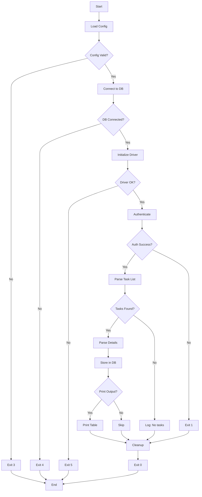

# Псевдокод: Парсер задач Gogetlinks

## Основной поток программы

```pseudocode
FUNCTION main():
    // === ФАЗА НАСТРОЙКИ ===
    logger = initialize_logger(config.logging)
    LOG INFO "Starting Gogetlinks Task Parser v1.0"

    TRY:
        config = load_config("config.ini")
        VALIDATE config.required_fields
        LOG INFO "Configuration loaded successfully"
    CATCH ConfigError as e:
        LOG ERROR "Config error: {e}"
        EXIT 3

    // === ИНИЦИАЛИЗАЦИЯ БАЗЫ ДАННЫХ ===
    TRY:
        db = connect_to_database(config.database)
        ensure_schema_exists(db)
        LOG INFO "Database connection established"
    CATCH DatabaseError as e:
        LOG ERROR "Database error: {e}"
        EXIT 4

    // === ИНИЦИАЛИЗАЦИЯ БРАУЗЕРА ===
    TRY:
        driver = initialize_selenium_driver(headless=True)
        LOG INFO "Browser driver initialized"
    CATCH WebDriverException as e:
        LOG ERROR "WebDriver error: {e}"
        EXIT 5

    // === ОСНОВНОЙ РАБОЧИЙ ПРОЦЕСС ===
    TRY:
        // Шаг 1: Аутентификация
        is_authenticated = authenticate(driver, config.gogetlinks, config.anticaptcha)
        IF NOT is_authenticated:
            LOG ERROR "Authentication failed"
            EXIT 1

        // Шаг 2: Парсинг задач
        tasks = parse_task_list(driver)
        LOG INFO "Found {len(tasks)} tasks"

        // Шаг 3: Получение деталей для новых задач
        IF config.parse_details:
            FOR EACH task IN tasks:
                IF NOT task_exists_in_db(db, task.task_id):
                    details = parse_task_details(driver, task.task_id)
                    task.merge(details)

        // Шаг 4: Сохранение в базу данных
        new_count = 0
        updated_count = 0
        FOR EACH task IN tasks:
            IF task_exists_in_db(db, task.task_id):
                update_task(db, task)
                updated_count++
            ELSE:
                insert_task(db, task)
                new_count++

        LOG INFO "Processed: {new_count} new, {updated_count} updated"

        // Шаг 5: Вывод в консоль (если включено)
        IF config.output.print_tasks:
            print_tasks_table(tasks)

        LOG INFO "Parsing completed successfully"
        EXIT 0

    CATCH Exception as e:
        LOG ERROR "Unexpected error: {e}"
        LOG ERROR traceback.format_exc()
        EXIT 99

    FINALLY:
        driver.quit()
        db.close()
        LOG INFO "Resources cleaned up"
END FUNCTION
```

## Модуль аутентификации

### authenticate(driver, credentials, anticaptcha_config)

```pseudocode
FUNCTION authenticate(driver, credentials, anticaptcha_config) -> Boolean:
    LOG INFO "Starting authentication"

    // Переход на страницу входа
    driver.get("https://gogetlinks.net/user/signIn")
    WAIT FOR page_load(timeout=10)

    // Проверка, выполнена ли уже аутентификация
    html = driver.page_source
    IF is_authenticated_markup(html):
        LOG INFO "Already authenticated (session valid)"
        RETURN True

    // Извлечение sitekey капчи
    TRY:
        captcha_element = driver.find_element(By.CSS_SELECTOR, "[data-sitekey]")
        sitekey = captcha_element.get_attribute("data-sitekey")
        LOG INFO "Captcha sitekey extracted: {sitekey}"
    CATCH NoSuchElementException:
        LOG WARNING "No captcha found on page"
        sitekey = None

    // Решение капчи (если присутствует)
    captcha_token = None
    IF sitekey IS NOT None:
        TRY:
            captcha_token = solve_captcha(
                api_key=anticaptcha_config.api_key,
                website_url="https://gogetlinks.net/user/signIn",
                sitekey=sitekey,
                max_attempts=3
            )
            LOG INFO "Captcha solved successfully"
        CATCH CaptchaError as e:
            LOG ERROR "Captcha solving failed: {e}"
            RETURN False

    // Заполнение формы входа
    TRY:
        email_field = WAIT FOR element(By.CSS_SELECTOR, "input[name='e_mail']", timeout=5)
        password_field = driver.find_element(By.CSS_SELECTOR, "input[name='password']")

        email_field.send_keys(credentials.username)
        password_field.send_keys(credentials.password)

        LOG INFO "Login form filled"
    CATCH NoSuchElementException as e:
        LOG ERROR "Login form fields not found: {e}"
        RETURN False

    // Вставка токена капчи (если решена)
    IF captcha_token IS NOT None:
        driver.execute_script(
            "document.getElementById('g-recaptcha-response').innerHTML = arguments[0];",
            captcha_token
        )

    // Отправка формы
    submit_button = driver.find_element(By.CSS_SELECTOR, "button[type='submit']")
    submit_button.click()

    // Ожидание редиректа и проверка
    SLEEP 3
    html = driver.page_source

    IF is_authenticated_markup(html):
        LOG INFO "Authentication successful"
        RETURN True
    ELSE:
        LOG ERROR "Authentication failed (incorrect credentials or captcha)"
        RETURN False
END FUNCTION

FUNCTION is_authenticated_markup(html: String) -> Boolean:
    RETURN (
        "href=\"/profile\"" IN html AND
        "Выйти" IN html
    )
END FUNCTION
```

### solve_captcha(api_key, website_url, sitekey, max_attempts)

```pseudocode
FUNCTION solve_captcha(api_key, website_url, sitekey, max_attempts=3) -> String:
    """
    Решение reCAPTCHA v2 с использованием API anti-captcha.com
    Возвращает: Строку токена капчи
    Вызывает: CaptchaError при неудаче
    """
    FOR attempt IN range(1, max_attempts + 1):
        TRY:
            LOG INFO "Captcha solve attempt {attempt}/{max_attempts}"

            // Создание задачи
            payload = {
                "clientKey": api_key,
                "task": {
                    "type": "NoCaptchaTaskProxyless",
                    "websiteURL": website_url,
                    "websiteKey": sitekey
                }
            }

            response = POST "https://api.anti-captcha.com/createTask"
                WITH json=payload

            IF response.status_code != 200:
                RAISE CaptchaError("API request failed")

            data = response.json()
            IF data.errorId != 0:
                RAISE CaptchaError(data.errorDescription)

            task_id = data.taskId
            LOG INFO "Task created: {task_id}"

            // Опрос для получения решения (максимум 120 секунд)
            start_time = NOW()
            WHILE (NOW() - start_time) < 120:
                SLEEP 5

                poll_payload = {
                    "clientKey": api_key,
                    "taskId": task_id
                }

                poll_response = POST "https://api.anti-captcha.com/getTaskResult"
                    WITH json=poll_payload

                poll_data = poll_response.json()

                IF poll_data.status == "ready":
                    token = poll_data.solution.gRecaptchaResponse
                    LOG INFO "Captcha solved"
                    RETURN token

                ELSE IF poll_data.status == "processing":
                    CONTINUE

                ELSE:
                    RAISE CaptchaError("Unknown status: {poll_data.status}")

            // Достигнут таймаут
            RAISE CaptchaError("Timeout waiting for captcha solution")

        CATCH CaptchaError as e:
            LOG WARNING "Attempt {attempt} failed: {e}"
            IF attempt == max_attempts:
                RAISE CaptchaError("All captcha solve attempts failed")
            SLEEP 10  // Задержка перед повторной попыткой

END FUNCTION
```

## Модуль парсера

### parse_task_list(driver)

```pseudocode
FUNCTION parse_task_list(driver) -> List[Task]:
    LOG INFO "Navigating to task list"

    driver.get("https://gogetlinks.net/webTask/index")

    // Ожидание загрузки таблицы задач
    TRY:
        WAIT FOR presence_of_elements(
            By.CSS_SELECTOR,
            "tr[id^='col_row_']",
            timeout=10
        )
    CATCH TimeoutException:
        LOG WARNING "No tasks found (table not loaded)"
        RETURN []

    // Извлечение строк задач
    task_rows = driver.find_elements(By.CSS_SELECTOR, "tr[id^='col_row_']")
    LOG INFO "Found {len(task_rows)} task rows"

    tasks = []
    FOR EACH row IN task_rows:
        TRY:
            task = parse_task_row(row)
            tasks.append(task)
        CATCH Exception as e:
            LOG WARNING "Failed to parse task row: {e}"
            CONTINUE

    RETURN tasks
END FUNCTION

FUNCTION parse_task_row(row: WebElement) -> Task:
    // Извлечение task_id из атрибута ID строки
    row_id = row.get_attribute("id")
    task_id = EXTRACT_INTEGER(row_id, pattern="col_row_(\d+)")

    // Извлечение ячеек таблицы
    cells = row.find_elements(By.TAG_NAME, "td")
    IF len(cells) < 6:
        RAISE ValueError("Incomplete task row")

    // Парсинг домена (ячейка 0)
    domain_link = cells[0].find_element(By.TAG_NAME, "a")
    domain = domain_link.text.strip()

    // Парсинг заказчика (ячейка 1)
    customer_link = cells[1].find_element(By.TAG_NAME, "a")
    customer = customer_link.text.strip()
    customer_url = customer_link.get_attribute("href")

    // Парсинг внешних ссылок (ячейка 2)
    external_links = PARSE_INT(cells[2].text.strip(), default=0)

    // Парсинг прошедшего времени (ячейка 4)
    time_passed = cells[4].text.strip()

    // Парсинг цены (ячейка 5)
    price_text = cells[5].text.strip()
    price = PARSE_DECIMAL(price_text, default=0.0)

    RETURN Task(
        task_id=task_id,
        domain=domain,
        customer=customer,
        customer_url=customer_url,
        external_links=external_links,
        time_passed=time_passed,
        price=price
    )
END FUNCTION
```

### parse_task_details(driver, task_id)

```pseudocode
FUNCTION parse_task_details(driver, task_id: Integer) -> TaskDetails:
    LOG INFO "Fetching details for task {task_id}"

    url = f"https://gogetlinks.net/template/view_task.php?curr_id={task_id}"
    driver.get(url)

    WAIT FOR page_load(timeout=10)
    html = driver.page_source

    // Преобразование кодировки при необходимости
    html = DECODE(html, from="windows-1251", to="utf-8")

    details = TaskDetails()

    // Извлечение заголовка
    TRY:
        title_element = driver.find_element(By.CSS_SELECTOR, "h1.task-title")
        details.title = title_element.text.strip()
    CATCH NoSuchElementException:
        details.title = None

    // Извлечение описания
    description_pattern = r"Текст задания</div>.+?block_value\">(.+?)</div>"
    match = REGEX_SEARCH(description_pattern, html, flags=DOTALL)
    IF match:
        details.description = HTML_UNESCAPE(match.group(1))

    // Извлечение требований
    requirements_pattern = r"Требования</div>.+?block_value\">(.+?)</div>"
    match = REGEX_SEARCH(requirements_pattern, html, flags=DOTALL)
    IF match:
        details.requirements = HTML_UNESCAPE(match.group(1))

    // Извлечение URL
    TRY:
        url_input = driver.find_element(By.ID, "copy_url")
        details.url = url_input.get_attribute("value")
    CATCH NoSuchElementException:
        details.url = None

    // Извлечение анкора
    TRY:
        anchor_input = driver.find_element(By.ID, "copy_unhor")
        details.anchor = anchor_input.get_attribute("value")
    CATCH NoSuchElementException:
        details.anchor = None

    // Извлечение источника
    TRY:
        source_input = driver.find_element(By.ID, "copy_source")
        details.source = source_input.get_attribute("value")
    CATCH NoSuchElementException:
        details.source = None

    // Извлечение контактов (если присутствуют)
    contacts_pattern = r"Контакты</div>.+?block_value\">(.+?)</div>"
    match = REGEX_SEARCH(contacts_pattern, html, flags=DOTALL)
    IF match:
        details.contacts = HTML_UNESCAPE(match.group(1))

    LOG INFO "Details extracted for task {task_id}"
    RETURN details
END FUNCTION
```

## Модуль базы данных

### insert_task(db, task)

```pseudocode
FUNCTION insert_task(db: Connection, task: Task) -> None:
    query = """
        INSERT INTO tasks (
            task_id, title, description, price, deadline,
            customer, customer_url, domain, url,
            requirements, contacts, external_links,
            time_passed, is_new, created_at
        ) VALUES (
            %s, %s, %s, %s, %s, %s, %s, %s, %s, %s, %s, %s, %s, %s, NOW()
        )
    """

    values = (
        task.task_id,
        task.title,
        task.description,
        task.price,
        task.deadline,
        task.customer,
        task.customer_url,
        task.domain,
        task.url,
        task.requirements,
        task.contacts,
        task.external_links,
        task.time_passed,
        1  // is_new = True
    )

    TRY:
        cursor = db.cursor()
        cursor.execute(query, values)
        db.commit()
        LOG INFO "Inserted task {task.task_id}"
    CATCH IntegrityError as e:
        LOG WARNING "Duplicate task_id {task.task_id} (race condition)"
        db.rollback()
    CATCH DatabaseError as e:
        LOG ERROR "Database error inserting task: {e}"
        db.rollback()
        RAISE
END FUNCTION

FUNCTION update_task(db: Connection, task: Task) -> None:
    query = """
        UPDATE tasks SET
            title = %s,
            description = %s,
            price = %s,
            deadline = %s,
            customer = %s,
            customer_url = %s,
            domain = %s,
            url = %s,
            requirements = %s,
            contacts = %s,
            external_links = %s,
            time_passed = %s,
            is_new = 0,
            updated_at = NOW()
        WHERE task_id = %s
    """

    values = (
        task.title, task.description, task.price, task.deadline,
        task.customer, task.customer_url, task.domain, task.url,
        task.requirements, task.contacts, task.external_links,
        task.time_passed, task.task_id
    )

    TRY:
        cursor = db.cursor()
        cursor.execute(query, values)
        db.commit()
        LOG INFO "Updated task {task.task_id}"
    CATCH DatabaseError as e:
        LOG ERROR "Database error updating task: {e}"
        db.rollback()
        RAISE
END FUNCTION

FUNCTION task_exists_in_db(db: Connection, task_id: Integer) -> Boolean:
    query = "SELECT 1 FROM tasks WHERE task_id = %s LIMIT 1"
    cursor = db.cursor()
    cursor.execute(query, (task_id,))
    result = cursor.fetchone()
    RETURN result IS NOT None
END FUNCTION
```

## Вспомогательные функции

### Очистка данных

```pseudocode
FUNCTION PARSE_INT(text: String, default: Integer = 0) -> Integer:
    TRY:
        RETURN INTEGER(text)
    CATCH ValueError:
        RETURN default
END FUNCTION

FUNCTION PARSE_DECIMAL(text: String, default: Decimal = 0.0) -> Decimal:
    // Удаление нецифровых символов, кроме . и ,
    cleaned = REMOVE_ALL(text, except="0-9.,")
    cleaned = REPLACE(cleaned, ",", ".")

    TRY:
        RETURN DECIMAL(cleaned)
    CATCH ValueError:
        RETURN default
END FUNCTION

FUNCTION HTML_UNESCAPE(text: String) -> String:
    // Преобразование HTML-сущностей в символы
    // &nbsp; → пробел
    // &lt; → <
    // &gt; → >
    // и т.д.
    RETURN html.unescape(text)
END FUNCTION

FUNCTION EXTRACT_INTEGER(text: String, pattern: String) -> Integer:
    match = REGEX_SEARCH(pattern, text)
    IF match:
        RETURN INTEGER(match.group(1))
    ELSE:
        RAISE ValueError("No match found for pattern")
END FUNCTION
```

## Структуры данных

```pseudocode
CLASS Task:
    ATTRIBUTES:
        task_id: Integer
        title: String (nullable)
        description: String (nullable)
        price: Decimal (nullable)
        deadline: DateTime (nullable)
        customer: String (nullable)
        customer_url: String (nullable)
        domain: String (nullable)
        url: String (nullable)
        requirements: String (nullable)
        contacts: String (nullable)
        external_links: Integer (nullable)
        time_passed: String (nullable)

    METHOD merge(details: TaskDetails):
        // Слияние полей деталей в эту задачу
        IF details.title IS NOT None:
            this.title = details.title
        IF details.description IS NOT None:
            this.description = details.description
        // ... и т.д. для всех полей деталей
END CLASS

CLASS TaskDetails:
    ATTRIBUTES:
        title: String (nullable)
        description: String (nullable)
        requirements: String (nullable)
        url: String (nullable)
        anchor: String (nullable)
        source: String (nullable)
        contacts: String (nullable)
END CLASS
```

## Стратегия обработки ошибок

```pseudocode
ИЕРАРХИЯ ИСКЛЮЧЕНИЙ:

Exception
├── ConfigError            → Код выхода 3
├── DatabaseError          → Код выхода 4
│   ├── ConnectionError
│   └── IntegrityError
├── WebDriverException     → Код выхода 5
│   ├── TimeoutException
│   ├── NoSuchElementException
│   └── StaleElementReferenceException
└── CaptchaError          → Код выхода 2

ПРАВИЛА ОБРАБОТКИ:
- Неудачи аутентификации → Код выхода 1
- Неудачи капчи → Код выхода 2 (после повторных попыток)
- Ошибки конфигурации → Код выхода 3 (критические, без повтора)
- Ошибки базы данных → Код выхода 4 (критические, без повтора)
- Ошибки WebDriver → Код выхода 5 (критические, без повтора)
- Непредвиденные ошибки → Код выхода 99
- Успех → Код выхода 0
```

---

## Диаграмма потока выполнения (Mermaid)



---

**Версия документа:** 1.0
**Алгоритмическая сложность:**
- Аутентификация: O(1) — фиксированные шаги
- Парсинг списка задач: O(n), где n = количество задач
- Парсинг деталей: O(m), где m = количество НОВЫХ задач
- Операции с базой данных: O(n) — пакетная вставка/обновление
- **Итого:** O(n + m) — линейная по количеству задач
